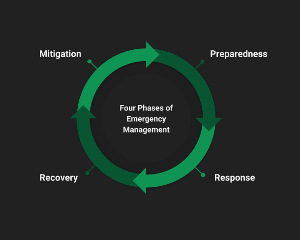
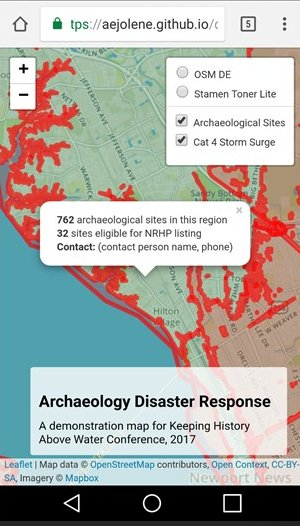

# Virginia Archaeology: Maps from Different Points of View
### Jolene Smith

#### Middle Atlantic Archaeology Conference 2018

  
**Abstract:** In the years ahead, archaeologists and emergency managers will need increasing capacity to respond to severe weather events driven by climate change. While Virginia’s archaeological geospatial data is generally protected, alternate ways of presenting and sharing information are needed, whether to respond to disasters, to crowdsource observations, or to develop a stewardship ethic among members of the general public. Using data served to the public through the Digital Index of North American Archaeology with obscured location information, this presentation will demonstrate new ways to present and interact with state archaeology records that bring them beyond the world of cultural resource management and regulatory compliance.

----------
  

### Introduction: Expectations for climate change impacts

Argument: our geospatial data is rich and valuable. By finding new ways to view it, we can expand our reach beyond a small subset of trained professionals and exponentially expand our reach and influence, helping sites. 

According to the Fourth National Climate Assessment published by the U.S. Global Change Research Program in November 2017, mid-Atlantic sea levels are projected to rise between 1 and 2 meters by the year 2100 (USGCRP 2017). Instability of sea ice introduces even more uncertainty, and differences in mass of land and sea ice produce varying rates of projected rise. 

*[“Changes in Sea Level in Sea Surface Height”](https://science2017.globalchange.gov/chapter/12#fig-12-3) from USGCRP 2017*

In addition to rising seas, changing global temperatures alter sea currents and weather patterns, causing an increase in the occurrence of severe storms and changes to the rates of shoreline erosion. The shoreline of the Chesapeake Bay in Virginia alone stretches over 7,000 miles (Berman 2010). It is no surprise to any archaeologist that a large proportion of human habitation sites stretching back millennia are in close proximity to the coast and shorelines.

### How we plan

In Virginia, we maintain records on around 44,000 archaeological sites, with more being added every day. In response to new priorities from the administration of Governor Terry McAullife in 2013, the Department of Historic Resources established a "Climate Change Impact Area" in order to monitor resources and target survey. To derive this area, DHR staff combined Category 4 storm surge area data (NOAA 2013) and the projected area to be inundated with a 5' sea level rise (TK source). \[TK impact area graphic\]

The goal of the area was not to predict which sites and above-ground historic properties would be flooded, but to instead target increased attention and documentation. The zone contains more than ten percent of all recorded archaeological sites and archaeological resources in the Commonwealth. Only TK percent of this area has been systematically surveyed for archaeological sites prior to 2013. The richness of our coastal heritage (not to mention the interconnected ecosystems) cannot be overstated.

In 2017, researchers from the Digital Index of North American Archaeology (DINAA) published a powerful article that demonstrated the magnitude of the potential impact to archaeological resources on the East Coast. (Anderson et al. 2017). Critically, this study not only examined areas very near the coast and at risk from direct, water-related impacts, but it also considered risks that might be caused by displacement of major population centers from the coasts inland. In Virginia, entire regions like Hampton Roads will likely feel pressures away from shorelines and rising water tables. 

The DINAA study considered archaeological sites from nine coastal states and found that over 19,000 sites will be inundated with a 1 meter sea level rise (a likely scenario within a century). In Virginia alone, a change in sea level at that magnitude will flood around 7,000 recorded sites, over 1,000 of which are at least potentially eligible for listing on the National Register of Historic Places (Anderson et al. 2017). The implications of coastal demographic displacement are even more striking. In Virginia, over 70% (n = 32181) of all recorded archaeological sites are within DINAA's considered 200 km distance from the coast. 

*[“Site incidence as it relates to potential loss from sea-level rise, grouped by elevation in meters above present mean sea level.”](https://doi.org/10.1371/journal.pone.0188142.g003) from Anderson et al. 2017*

Funding made available by the [National Park Service](https://www.nps.gov/preservation-grants/disaster-recovery/index.html) after Hurricane Sandy devastated the mid- and north-Atlantic coast in 2012 enabled the Department of Historic Resources to engage in systematic assessment of individual sites and properties. The agency published a request for proposals in order to design a study that would assess change to recorded archaeological sites in several eligible counties. The [Longwood Institute of Archaeology](http://www.longwood.edu/archaeology/) under Dr. Brian Bates (also presenting in this session) produced a methodology that combines a vulnerability assessment using statistical methods to make high-resolution predictions about coastal change rates with a geospatial predictive model in order to prioritize sites requiring physical assessment among thousands in coastal and shoreline areas (Bates et al. 2017).

\[possible graphic\]

These three initiatives address risk to sites at three very different scales — continental, statewide, and site-level. Taken together, these and similar approaches make up a powerful planning toolbox as we come to terms with the realities of climate change and its impacts.

### How we respond and recover

Within the life cycle of a disaster, impacts to and protections for cultural resources can be found at any level (FEMA 2011). Disaster response is, by its very nature, a speedier and more time-sensitive affair. Human health and safety along with economic stability rank at the top of priority lists. Still, recovery officers have an opportunity to protect and document archaeological sites and other cultural resources. During the recovery phase, communities begin to put the pieces back together. 

  
*The four phases of emergency management. Consideration of cultural resources can happen at all phases, but occurs mostly during recovery.*

The SHPO (state historic preservation office) maintains an inventory of cultural resources. Our task is to figure out the best ways to convey these data and their meaning appropriately to many different audiences who may not have archaeological or architectural history expertise. Potential audiences include disaster response personnel from federal agencies, state agencies, and local governments, planners at the local level, and other state and federal agency staff who may find themselves involved in compliance with Section 106 the National Historic Preservation Act due to recovery-related federal undertakings. Other audiences include property owners, descendent communities, and members of the general public with an interest in archaeology and preservation.

### Risks of sharing too much data

In order to address disasters (and facilitate research, provide public outreach, ethically and effectively manage historic resources, et cetera), sharing data is central. We need to be able to communicate clearly and quickly to non-archaeologists what we have and why it's important. But it is easy to overshoot, and the consequences can be severe and permanent (Smith 2016). 

Data managers (myself absolutely included) take archaeological site sensitivity very seriously. Section 304 of the National Historic Preservation Act of 1966 (16 U.S.C. 4702-3) indicates that officials

> "shall withhold from disclosure to the public information about the
> location, character, or ownership of a historic property if the
> Secretary and the agency determine that disclosure may-  
> 
> (1) cause a significant invasion of privacy;   (2) risk harm to the
> historic property; or   (3) impede the use of a traditional religious
> site by practitioners"  
> 
> [(National Historic Preservation Act of 1966)](https://www.nps.gov/history/local-law/nhpa1966.htm)

For archaeological sites, this generally means restricting access to specific details about the location and nature of sites (this is interpreted in a myriad of different ways, but that's another paper). 

In an emergency, people who need to understand impacts to archaeological sites may not be professional archaeologists or trained in cultural resource management. They may not understand the sensitive nature of archaeological sites. Distributing static geospatial data at full resolution creates particular vulnerabilities, as a .zip archive of shapefiles is easy to share and can find its way onto public-facing websites very easily. Releasing detailed locations of certain types of archaeological sites (namely those including Virginia Indian human remains and grave goods, as well as shipwrecks, Civil War and Colonial-era sites) places them at high risk for looting and vandalism. 

Even if archaeological data stays safely out of the hands of bad actors, we risk overwhelming people outside of the cultural resource management world with too much information, often presented in potentially confusing ways. For example, take a concurrence from the Department of Historic Resources that a resource is *potentially eligible for listing on the National Register of Historic Places*, even though in reality all historic properties are considered potentially eligible until evaluated to be ineligible. It's confusing. Archaeological boundaries can also be misleading. Does a polygon represent the entirety of a site, or is it limited to the portion surveyed for a particular project? It takes a certain degree of training to correctly interpret what's often a torrent of data. Compound with a tense emergency situation and overextended staff and the risks for mistakes continue to grow.

### Risks of sharing too little

Because sharing just the right amount of archaeological data is not simple, many data repositories take the conservative approach of withholding everything archaeological from public-facing applications, for fear of making an irreversible mistake. While it's true that we can't un-ring the bell of sensitive data release, there are other consequences to keeping things too close to the belt. In the wake of a disaster, a property owner, a concerned citizen, or even someone working outside of a cultural resources division for a government agency might not even realize there are resources at risk in a given area. With no easy avenue to help, we might lose even more of our irreplaceable cultural heritage. 

We can explore ways to achieve a balance between the restrictive and vulnerable ends of the spectrum by opening up non-sensitive data and displaying it ways that meet specific needs and answer particular questions.  

### Examples:

#### Agency response map

This is a demonstration mobile app created for the Keeping History Above Water conference in Annapolis, MD (2017). The accompanying paper, ["Using the Digital Index of North American Archaeology for Rapid Disaster Response and Reporting,"](https://github.com/aejolene/disastermap) is available online, along with the code for the map (Smith et al. 2017). The authors demonstrate how archaeology data available at a safe, public scale can be used to create a tool to quickly connect agency responders with SHPO staff, using a presence/absence map that works on mobile devices.

<a class ="btn btn-primary" href="https://aejolene.github.io/disastermap/ target="_blank">Explore the Interactive Disaster Response Demo Map</a>

[Explore the Interactive Disaster Response Demo Map](https://aejolene.github.io/disastermap/){: .btn}

\[1\] Audience: volunteer condition assessors- leaflet plus kobo form

#### Crowdsourcing conditions- citizen science

\[1\] Audience: general public

#### Sharing information to build coalitions- WHO CARES?

### Ways to present maps to the public

MSUDAI example (could move to COVA)

  

### \[1\] Other exemplars

SCAPE in scotland

### \[1\] Wrap up- 
building in flexibility to view our GIS data in flexible ways can have implications beyond climate change. Also relevant to people outside of DHR. What can you do? Make data interoperable, link it, choose non-proprietary formats for distribution

  

  
#### References

Anderson, David G., Thaddeus G. Bissett, Stephen J. Yerka, Joshua J. Wells, Eric C. Kansa, Sarah W. Kansa, Kelsey Noack Myers, R. Carl DeMuth, and Devin A. White. 2017. “Sea-Level Rise and Archaeological Site Destruction: An Example from the Southeastern United States Using DINAA (Digital Index of North American Archaeology).” _PLOS ONE_ 12 (11): e0188142. [https://doi.org/10.1371/journal.pone.0188142](https://doi.org/10.1371/journal.pone.0188142).

Bates vulnerability assessment

Berman, Marcia. 2010. “How Long Is Virginia’s Shoreline?” The Length of the Commonwealth’s Shoreline. April 2, 2010. [http://www.vims.edu/bayinfo/faqs/shoreline_miles.php](http://www.vims.edu/bayinfo/faqs/shoreline_miles.php).

FEMA. 2011. “National Disaster Recovery Framework.” [https://www.fema.gov/pdf/recoveryframework/ndrf.pdf](https://www.fema.gov/pdf/recoveryframework/ndrf.pdf).

Smith, Jolene. 2016. "Approaches to Openness." Society for Historical Archaeology, Baltimore, MD. [https://jolenesmith.net/approaches-to-openness/html.](https://jolenesmith.net/approaches-to-openness/html)

Smith, Jolene, David G. Anderson, Eric Kansa, Joshua Wells, and Stephen Yerka. 2017. “Using the Digital Index of North American Archaeology for Rapid Disaster Response and Reporting.” Keeping History Above Water, Annapolis, MD. [https://github.com/aejolene/disastermap](https://github.com/aejolene/disastermap).

USGCRP. 2017. “Climate Science Special Report Chapter 12: Sea Level Rise.” 2017. [https://science2017.globalchange.gov/chapter/12/](https://science2017.globalchange.gov/chapter/12/).
