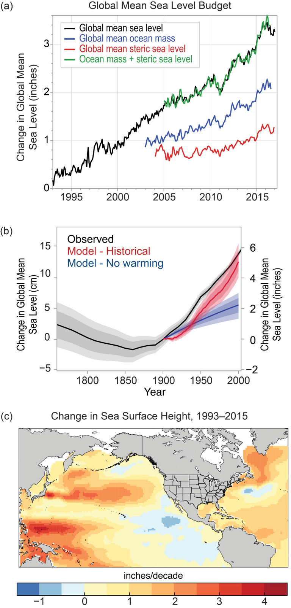
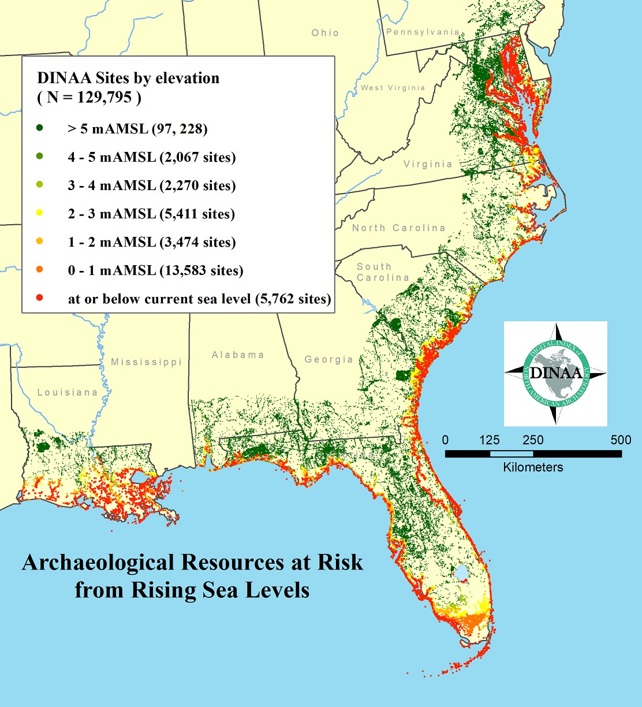

# Virginia Archaeology: Maps from Different Points of View
### Jolene Smith

#### Middle Atlantic Archaeology Conference 2018

  
**Abstract:** In the years ahead, archaeologists and emergency managers will need increasing capacity to respond to severe weather events driven by climate change. While Virginia’s archaeological geospatial data is generally protected, alternate ways of presenting and sharing information are needed, whether to respond to disasters, to crowdsource observations, or to develop a stewardship ethic among members of the general public. Using data served to the public through the Digital Index of North American Archaeology with obscured location information, this presentation will demonstrate new ways to present and interact with state archaeology records that bring them beyond the world of cultural resource management and regulatory compliance.

  

### Introduction: Expectations for climate change impacts

Argument: our geospatial data is rich and valuable. By finding new ways to view it, we can expand our reach beyond a small subset of trained professionals and exponentially expand our reach and influence, helping sites. 

According to the Fourth National Climate Assessment published by the U.S. Global Change Research Program in November 2017, mid-Atlantic sea levels are projected to rise between 1 and 2 meters by the year 2100 (USGCRP 2017). Instability of sea ice introduces even more uncertainty, and differences in mass of land and sea ice produce varying rates of projected rise. 

*[“Changes in Sea Level in Sea Surface Height”](https://science2017.globalchange.gov/chapter/12#fig-12-3) from USGCRP 2017*

In addition to rising seas, changing global temperatures alter sea currents and weather patterns, causing an increase in the occurrence of severe storms and changes to the rates of shoreline erosion. The shoreline of the Chesapeake Bay in Virginia alone stretches over 7,000 miles (Berman 2010). It is no surprise to any archaeologist that a large proportion of human habitation sites stretching back millennia are in close proximity to the coast and shorelines.

### How we plan

In Virginia, we maintain records on around 44,000 archaeological sites, with more being added every day. In response to new priorities from the administration of Governor Terry McAullife in 2013, the Department of Historic Resources established a "Climate Change Impact Area" in order to monitor resources and target survey. To derive this area, DHR staff combined Category 4 storm surge area data (NOAA 2013) and the projected area to be inundated with a 5' sea level rise (TK source). \[TK impact area graphic\]

The goal of the area was not to predict which sites and above-ground historic properties would be flooded, but to instead target increased attention and documentation. The zone contains more than ten percent of all recorded archaeological sites and archaeological resources in the Commonwealth. Only TK percent of this area has been systematically surveyed for archaeological sites prior to 2013. The richness of our coastal heritage (not to mention the interconnected ecosystems) cannot be overstated.

In 2017, researchers from the Digital Index of North American Archaeology (DINAA) published a powerful article that demonstrated the magnitude of the potential impact to archaeological resources on the East Coast. (Anderson et al. 2017). Critically, this study not only examined areas very near the coast and at risk from direct, water-related impacts, but it also considered risks that might be caused by displacement of major population centers from the coasts inland. In Virginia, entire regions like Hampton Roads will likely feel pressures away from shorelines and rising water tables. 

The DINAA study considered archaeological sites from nine coastal states and found that over 19,000 sites will be inundated with a 1 meter sea level rise (a likely scenario within a century). In Virginia alone, a change in sea level at that magnitude will flood around 7,000 recorded sites, over 1,000 of which are at least potentially eligible for listing on the National Register of Historic Places (Anderson et al. 2017). The implications of coastal demographic displacement are even more striking. In Virginia, over 70% (n = 32181) of all recorded archaeological sites are within DINAA's considered 200 km distance from the coast. 

[“Site incidence as it relates to potential loss from sea-level rise, grouped by elevation in meters above present mean sea level.”](https://doi.org/10.1371/journal.pone.0188142.g003) from Anderson et al. 2017*

\[1\] Resource specific: Longwood’s coastal change & predictive models

### How we respond

\[1\] Lots of different audiences: From DHR’s point of view

### Risks to sharing too much data

Site location disclosure- looting/vandalism

Overwhelming or misleading non-archaeologists

### Risks to too little data shared

No awareness of risk to heritage resources

No avenue to help

  

### Examples:

\[1\] Audience: other agencies:

#### Agency response map

\[1\] Audience: volunteer condition assessors- leaflet plus kobo form

#### Crowdsourcing conditions- citizen science

\[1\] Audience: general public

#### Sharing information to build coalitions- WHO CARES?

### Ways to present maps to the public

MSUDAI example (could move to COVA)

  

### \[1\] Other exemplars

SCAPE in scotland

### \[1\] Wrap up- 
building in flexibility to view our GIS data in flexible ways can have implications beyond climate change. Also relevant to people outside of DHR. What can you do? Make data interoperable, link it, choose non-proprietary formats for distribution

  

  
#### References

Anderson, David G., Thaddeus G. Bissett, Stephen J. Yerka, Joshua J. Wells, Eric C. Kansa, Sarah W. Kansa, Kelsey Noack Myers, R. Carl DeMuth, and Devin A. White. 2017. “Sea-Level Rise and Archaeological Site Destruction: An Example from the Southeastern United States Using DINAA (Digital Index of North American Archaeology).” _PLOS ONE_ 12 (11): e0188142. [https://doi.org/10.1371/journal.pone.0188142](https://doi.org/10.1371/journal.pone.0188142).

Berman, Marcia. 2010. “How Long Is Virginia’s Shoreline?” The Length of the Commonwealth’s Shoreline. April 2, 2010. [http://www.vims.edu/bayinfo/faqs/shoreline_miles.php](http://www.vims.edu/bayinfo/faqs/shoreline_miles.php).

USGCRP. 2017. “Climate Science Special Report Chapter 12: Sea Level Rise.” 2017. [https://science2017.globalchange.gov/chapter/12/](https://science2017.globalchange.gov/chapter/12/).
